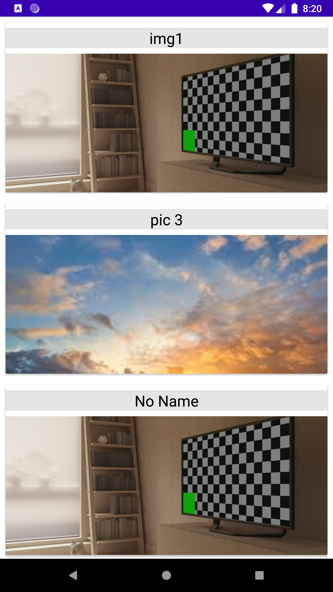

College Management App
===================================

The main objective of college management system is to automate most of the functionalities of a college or university.

**Features**
====================================

1. It has 2 modules _Admin_ and _Student_ where the staff can login through the admin and update/post information which can be viewed by the students in **Realtime**.   
  
    &nbsp;

2. It has login features with **authentication** and autocomplete with the flexibility to dynamically register new users.  

    &nbsp;
    &nbsp;
    
3. Upload and delete notice through the admin. Students can view the notices in realtime.    

    &nbsp;
    &nbsp;
    
 4. Upload images to college Gallery.  
   
     &nbsp;
     &nbsp;
     
 5. Report or give feedback through an external e-mail Intent.  
 
     &nbsp;
     &nbsp;
